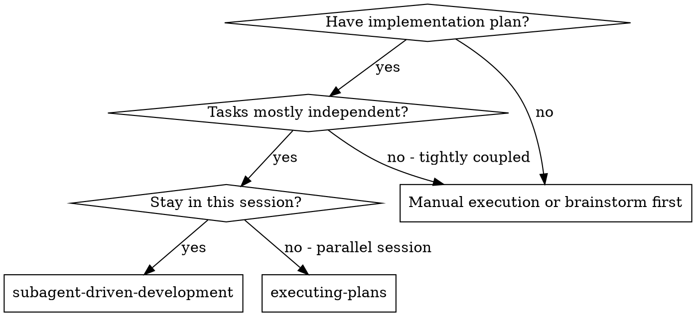
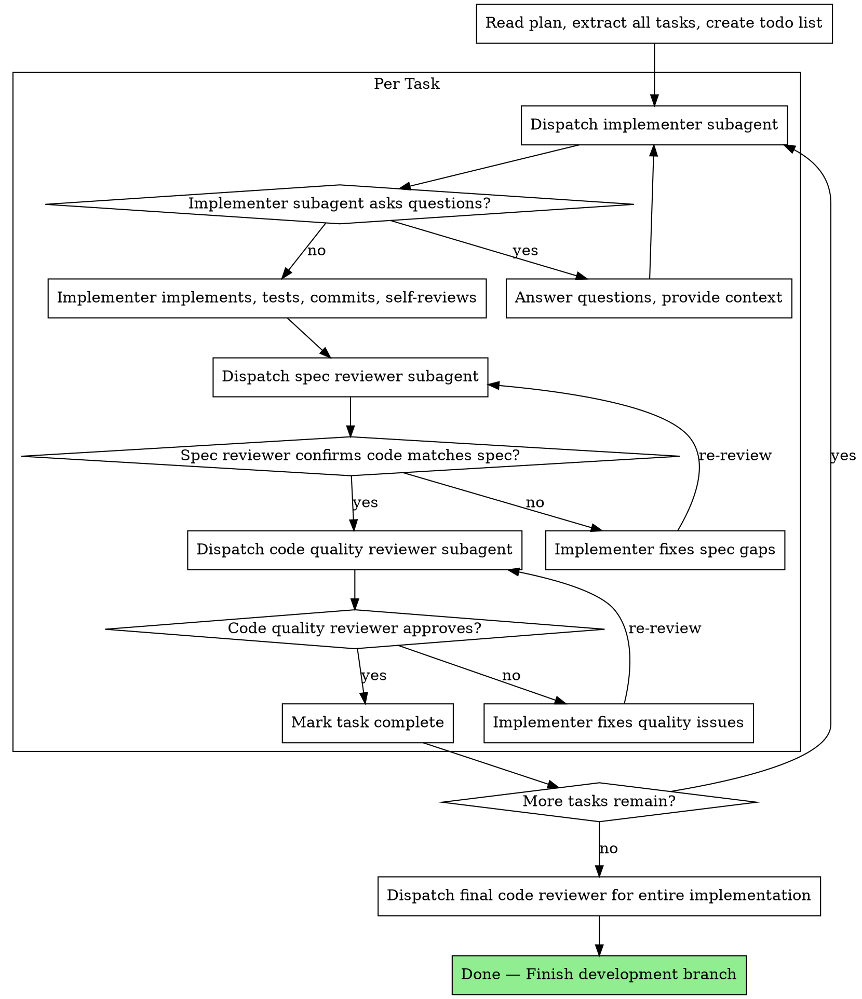

# Subagent-Driven Development

## Overview

Execute implementation plans by dispatching fresh subagents per task with systematic two-stage review.

**Why subagents:** You delegate tasks to specialized agents with isolated context. By precisely crafting their instructions and context, you ensure they stay focused and succeed at their task. They should never inherit your session's context or history — you construct exactly what they need. This also preserves your own context for coordination work.

**Core principle:** Fresh subagent per task + two-stage review (spec then quality) = high quality, fast iteration

## When to Use



**vs. Executing Plans (parallel session):**
- Same session (no context switch)
- Fresh subagent per task (no context pollution)
- Two-stage review after each task: spec compliance first, then code quality
- Faster iteration (no human-in-loop between tasks)

## The Process



## Step-by-Step Workflow

### 1. Read and Parse Plan

Read the plan file. Extract ALL tasks with their full text and context upfront. Create a todo list:

```python
# Read the plan
read_file("docs/plans/feature-plan.md")

# Create todo list with all tasks
todo([
    {"id": "task-1", "content": "Create User model with email field", "status": "pending"},
    {"id": "task-2", "content": "Add password hashing utility", "status": "pending"},
    {"id": "task-3", "content": "Create login endpoint", "status": "pending"},
])
```

**Key:** Read the plan ONCE. Extract everything. Don't make subagents read the plan file — provide the full task text directly in context.

### 2. Per-Task Workflow

For EACH task in the plan:

#### Step 1: Dispatch Implementer Subagent

Use `delegate_task` with complete context:

```python
delegate_task(
    goal="Implement Task 1: Create User model with email and password_hash fields",
    context="""
    TASK FROM PLAN:
    - Create: src/models/user.py
    - Add User class with email (str) and password_hash (str) fields
    - Use bcrypt for password hashing
    - Include __repr__ for debugging

    FOLLOW TDD:
    1. Write failing test in tests/models/test_user.py
    2. Run: pytest tests/models/test_user.py -v (verify FAIL)
    3. Write minimal implementation
    4. Run: pytest tests/models/test_user.py -v (verify PASS)
    5. Run: pytest tests/ -q (verify no regressions)
    6. Commit: git add -A && git commit -m "feat: add User model with password hashing"

    PROJECT CONTEXT:
    - Python 3.11, Flask app in src/app.py
    - Existing models in src/models/
    - Tests use pytest, run from project root
    - bcrypt already in requirements.txt
    """,
    toolsets=['terminal', 'file']
)
```

#### Step 2: Dispatch Spec Compliance Reviewer

After the implementer completes, verify against the original spec:

```python
delegate_task(
    goal="Review if implementation matches the spec from the plan",
    context="""
    ORIGINAL TASK SPEC:
    - Create src/models/user.py with User class
    - Fields: email (str), password_hash (str)
    - Use bcrypt for password hashing
    - Include __repr__

    CHECK:
    - [ ] All requirements from spec implemented?
    - [ ] File paths match spec?
    - [ ] Function signatures match spec?
    - [ ] Behavior matches expected?
    - [ ] Nothing extra added (no scope creep)?

    OUTPUT: PASS or list of specific spec gaps to fix.
    """,
    toolsets=['file']
)
```

**If spec issues found:** Fix gaps, then re-run spec review. Continue only when spec-compliant.

#### Step 3: Dispatch Code Quality Reviewer

After spec compliance passes:

```python
delegate_task(
    goal="Review code quality for Task 1 implementation",
    context="""
    FILES TO REVIEW:
    - src/models/user.py
    - tests/models/test_user.py

    CHECK:
    - [ ] Follows project conventions and style?
    - [ ] Proper error handling?
    - [ ] Clear variable/function names?
    - [ ] Adequate test coverage?
    - [ ] No obvious bugs or missed edge cases?
    - [ ] No security issues?

    OUTPUT FORMAT:
    - Critical Issues: [must fix before proceeding]
    - Important Issues: [should fix]
    - Minor Issues: [optional]
    - Verdict: APPROVED or REQUEST_CHANGES
    """,
    toolsets=['file']
)
```

**If quality issues found:** Fix issues, re-review. Continue only when approved.

#### Step 4: Mark Complete

```python
todo([{"id": "task-1", "content": "Create User model with email field", "status": "completed"}], merge=True)
```

### 3. Final Review

After ALL tasks are complete, dispatch a final integration reviewer:

```python
delegate_task(
    goal="Review the entire implementation for consistency and integration issues",
    context="""
    All tasks from the plan are complete. Review the full implementation:
    - Do all components work together?
    - Any inconsistencies between tasks?
    - All tests passing?
    - Ready for merge?
    """,
    toolsets=['terminal', 'file']
)
```

### 4. Verify and Commit

```bash
# Run full test suite
pytest tests/ -q

# Review all changes
git diff --stat

# Final commit if needed
git add -A && git commit -m "feat: complete [feature name] implementation"
```

## Model Selection

Use the least powerful model that can handle each role to conserve cost and increase speed.

**Mechanical implementation tasks** (isolated functions, clear specs, 1-2 files): use a fast, cheap model. Most implementation tasks are mechanical when the plan is well-specified.

**Integration and judgment tasks** (multi-file coordination, pattern matching, debugging): use a standard model.

**Architecture, design, and review tasks**: use the most capable available model.

**Task complexity signals:**
- Touches 1-2 files with a complete spec → cheap model
- Touches multiple files with integration concerns → standard model
- Requires design judgment or broad codebase understanding → most capable model

## Task Granularity

**Each task = 2-5 minutes of focused work.**

**Too big:**
- "Implement user authentication system"

**Right size:**
- "Create User model with email and password fields"
- "Add password hashing function"
- "Create login endpoint"
- "Add JWT token generation"
- "Create registration endpoint"

## Handling Implementer Status

Implementer subagents report one of four statuses. Handle each appropriately:

**DONE:** Proceed to spec compliance review.

**DONE_WITH_CONCERNS:** The implementer completed the work but flagged doubts. Read the concerns before proceeding. If the concerns are about correctness or scope, address them before review. If they're observations (e.g., "this file is getting large"), note them and proceed to review.

**NEEDS_CONTEXT:** The implementer needs information that wasn't provided. Provide the missing context and re-dispatch.

**BLOCKED:** The implementer cannot complete the task. Assess the blocker:
1. If it's a context problem, provide more context and re-dispatch with the same model
2. If the task requires more reasoning, re-dispatch with a more capable model
3. If the task is too large, break it into smaller pieces
4. If the plan itself is wrong, escalate to the human

**Never** ignore an escalation or force the same model to retry without changes. If the implementer said it's stuck, something needs to change.

## Red Flags — Never Do These

- Start implementation without a plan or on main/master branch without explicit user consent
- Skip reviews (spec compliance OR code quality)
- Proceed with unfixed critical/important issues
- Dispatch multiple implementation subagents for tasks that touch the same files
- Make subagent read the plan file (provide full text in context instead)
- Skip scene-setting context (subagent needs to understand where the task fits)
- Ignore subagent questions (answer before letting them proceed)
- Accept "close enough" on spec compliance (spec reviewer found issues = not done)
- Skip review loops (reviewer found issues → implementer fixes → review again)
- Let implementer self-review replace actual review (both are needed)
- **Start code quality review before spec compliance is PASS** (wrong order)
- Move to next task while either review has open issues

## Handling Issues

### If Subagent Asks Questions
- Answer clearly and completely
- Provide additional context if needed
- Don't rush them into implementation

### If Reviewer Finds Issues
- Implementer subagent (or a new one) fixes them
- Reviewer reviews again
- Repeat until approved
- Don't skip the re-review

### If Subagent Fails a Task
- Dispatch a new fix subagent with specific instructions about what went wrong
- Don't try to fix manually in the controller session (context pollution)

## Advantages

**vs. Manual execution:**
- Subagents follow TDD naturally
- Fresh context per task (no confusion)
- Parallel-safe (subagents don't interfere)
- Subagent can ask questions (before AND during work)

**vs. Executing Plans:**
- Same session (no handoff)
- Continuous progress (no waiting)
- Review checkpoints automatic

**Efficiency gains:**
- No file reading overhead (controller provides full text)
- Controller curates exactly what context is needed
- Subagent gets complete information upfront
- Questions surfaced before work begins (not after)

**Quality gates:**
- Self-review catches issues before handoff
- Two-stage review: spec compliance, then code quality
- Review loops ensure fixes actually work
- Spec compliance prevents over/under-building
- Code quality ensures implementation is well-built

**Cost trade-off:**
- More subagent invocations (implementer + 2 reviewers per task)
- Controller does more prep work (extracting all tasks upfront)
- Review loops add iterations
- But catches issues early (cheaper than debugging compounded problems later)

## Integration with Other Skills

### With writing-plans
This skill EXECUTES plans created by the writing-plans skill:
1. User requirements → writing-plans → implementation plan
2. Implementation plan → subagent-driven-development → working code

### With test-driven-development
Implementer subagents should follow TDD:
1. Write failing test first
2. Implement minimal code
3. Verify test passes
4. Commit

Include TDD instructions in every implementer context.

### With requesting-code-review
The two-stage review process IS the code review. For final integration review, use the requesting-code-review skill's review dimensions.

### With systematic-debugging
If a subagent encounters bugs during implementation:
1. Follow systematic-debugging process
2. Find root cause before fixing
3. Write regression test
4. Resume implementation

## Prompt Templates

- `./implementer-prompt.md` — Dispatch implementer subagent
- `./spec-reviewer-prompt.md` — Dispatch spec compliance reviewer subagent
- `./code-quality-reviewer-prompt.md` — Dispatch code quality reviewer subagent

## Example Workflow

```
[Read plan: docs/plans/auth-feature.md]
[Create todo list with 5 tasks]

--- Task 1: Create User model ---
[Dispatch implementer subagent]
  Implementer: "Should email be unique?"
  You: "Yes, email must be unique"
  Implementer: Implemented, 3/3 tests passing, committed.

[Dispatch spec reviewer]
  Spec reviewer: ✅ PASS — all requirements met

[Dispatch quality reviewer]
  Quality reviewer: ✅ APPROVED — clean code, good tests

[Mark Task 1 complete]

--- Task 2: Password hashing ---
[Dispatch implementer subagent]
  Implementer: No questions, implemented, 5/5 tests passing.

[Dispatch spec reviewer]
  Spec reviewer: ❌ Missing: password strength validation (spec says "min 8 chars")

[Implementer fixes]
  Implementer: Added validation, 7/7 tests passing.

[Dispatch spec reviewer again]
  Spec reviewer: ✅ PASS

[Dispatch quality reviewer]
  Quality reviewer: Important: Magic number 8, extract to constant
  Implementer: Extracted MIN_PASSWORD_LENGTH constant
  Quality reviewer: ✅ APPROVED

[Mark Task 2 complete]

... (continue for all tasks)

[After all tasks: dispatch final integration reviewer]
[Run full test suite: all passing]
[Done!]
```

## Remember

```
Fresh subagent per task
Two-stage review every time
Spec compliance FIRST
Code quality SECOND
Never skip reviews
Catch issues early
```

**Quality is not an accident. It's the result of systematic process.**
