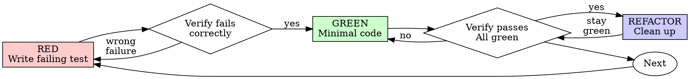

# Test-Driven Development (TDD) — Combined Mega-Skill

> Write the test first. Watch it fail. Write minimal code to pass.

**Core principle:** If you didn't watch the test fail, you don't know if it tests the right thing.

**Violating the letter of the rules is violating the spirit of the rules.**

---

## When to Activate

- Writing new features or functionality
- Fixing bugs or issues
- Refactoring existing code
- Adding API endpoints
- Creating new components
- Behavior changes

**Exceptions (ask your human partner):**
- Throwaway prototypes
- Generated code
- Configuration files

Thinking "skip TDD just this once"? Stop. That's rationalization.

| Scenario | TDD Value |
|----------|-----------|
| New feature | High |
| Bug fix | High (write test first) |
| Complex logic | High |
| Exploratory | Low (spike, then TDD) |
| UI layout | Low |

---

## The Iron Law

```
NO PRODUCTION CODE WITHOUT A FAILING TEST FIRST
```

Write code before the test? Delete it. Start over.

**No exceptions:**
- Don't keep it as "reference"
- Don't "adapt" it while writing tests
- Don't look at it
- Delete means delete

Implement fresh from tests. Period.

---

## The Three Laws of TDD

1. Write production code only to make a failing test pass
2. Write only enough test to demonstrate failure
3. Write only enough code to make the test pass

---

## The TDD Cycle

```
🔴 RED → Write failing test
    ↓
🟢 GREEN → Write minimal code to pass
    ↓
🔵 REFACTOR → Improve code quality
    ↓
   Repeat...
```

<!-- Source: superpowers — graphviz version -->


---

## RED Phase — Write Failing Test

Write one minimal test showing what should happen.

### RED Phase Rules

- Test must fail first
- Test name describes expected behavior
- One assertion per test (ideally)
- One behavior per test ("and" in name? Split it)
- Real code, not mocks (unless truly unavoidable)

### What to Test

| Focus | Example |
|-------|---------|
| Behavior | "should add two numbers" |
| Edge cases | "should handle empty input" |
| Error states | "should throw for invalid data" |

### Good Test (TypeScript)
<!-- Source: superpowers -->
```typescript
test('retries failed operations 3 times', async () => {
  let attempts = 0;
  const operation = () => {
    attempts++;
    if (attempts < 3) throw new Error('fail');
    return 'success';
  };

  const result = await retryOperation(operation);

  expect(result).toBe('success');
  expect(attempts).toBe(3);
});
```
Clear name, tests real behavior, one thing.

### Good Test (Python)
<!-- Source: hermes-agent -->
```python
def test_retries_failed_operations_3_times():
    attempts = 0
    def operation():
        nonlocal attempts
        attempts += 1
        if attempts < 3:
            raise Exception('fail')
        return 'success'

    result = retry_operation(operation)

    assert result == 'success'
    assert attempts == 3
```

### Bad Test Examples

```typescript
// ❌ Vague name, tests mock not code
test('retry works', async () => {
  const mock = jest.fn()
    .mockRejectedValueOnce(new Error())
    .mockRejectedValueOnce(new Error())
    .mockResolvedValueOnce('success');
  await retryOperation(mock);
  expect(mock).toHaveBeenCalledTimes(3);
});
```

```python
# ❌ Vague name, tests mock not real code
def test_retry_works():
    mock = MagicMock()
    mock.side_effect = [Exception(), Exception(), 'success']
    result = retry_operation(mock)
    assert result == 'success'
```

---

## Verify RED — Watch It Fail

**MANDATORY. Never skip.**

```bash
# TypeScript/JavaScript
npm test path/to/test.test.ts

# Python
pytest tests/test_feature.py::test_specific_behavior -v
```

Confirm:
- Test fails (not errors from typos)
- Failure message is expected
- Fails because feature missing (not typos)

**Test passes?** You're testing existing behavior. Fix test.

**Test errors?** Fix error, re-run until it fails correctly.

<!-- Source: everything-claude-code -->
### Runtime RED vs Compile-time RED

- **Runtime RED:**
  - The relevant test target compiles successfully
  - The new or changed test is actually executed
  - The result is RED
- **Compile-time RED:**
  - The new test newly instantiates, references, or exercises the buggy code path
  - The compile failure is itself the intended RED signal
- In either case, the failure is caused by the intended business-logic bug, undefined behavior, or missing implementation
- The failure is not caused only by unrelated syntax errors, broken test setup, missing dependencies, or unrelated regressions

A test that was only written but not compiled and executed does not count as RED.

Do not edit production code until this RED state is confirmed.

---

## GREEN Phase — Minimal Code

Write simplest code to pass the test. Nothing more.

### GREEN Phase Principles

| Principle | Meaning |
|-----------|---------|
| **YAGNI** | You Aren't Gonna Need It |
| **Simplest thing** | Write the minimum to pass |
| **No optimization** | Just make it work |

### Good Implementation
```typescript
async function retryOperation<T>(fn: () => Promise<T>): Promise<T> {
  for (let i = 0; i < 3; i++) {
    try {
      return await fn();
    } catch (e) {
      if (i === 2) throw e;
    }
  }
  throw new Error('unreachable');
}
```
Just enough to pass.

### Bad Implementation
```typescript
// ❌ Over-engineered
async function retryOperation<T>(
  fn: () => Promise<T>,
  options?: {
    maxRetries?: number;
    backoff?: 'linear' | 'exponential';
    onRetry?: (attempt: number) => void;
  }
): Promise<T> {
  // YAGNI
}
```

<!-- Source: hermes-agent -->
### Cheating is OK in GREEN:
- Hardcode return values
- Copy-paste
- Duplicate code
- Skip edge cases

We'll fix it in REFACTOR.

Don't add features, refactor other code, or "improve" beyond the test.

---

## Verify GREEN — Watch It Pass

**MANDATORY.**

```bash
# TypeScript/JavaScript
npm test path/to/test.test.ts

# Python — specific test
pytest tests/test_feature.py::test_specific_behavior -v
# Python — full suite to check regressions
pytest tests/ -q
```

Confirm:
- Test passes
- Other tests still pass
- Output pristine (no errors, warnings)

**Test fails?** Fix code, not test.

**Other tests fail?** Fix regressions now.

---

## REFACTOR Phase — Clean Up

After green only:
- Remove duplication
- Improve names
- Extract helpers
- Simplify expressions
- Optimize performance
- Enhance readability

### REFACTOR Rules

- All tests must stay green
- Small incremental changes
- Commit after each refactor
- Don't add behavior

**If tests fail during refactor:** Undo immediately. Take smaller steps.

### What to Improve

| Area | Action |
|------|--------|
| Duplication | Extract common code |
| Naming | Make intent clear |
| Structure | Improve organization |
| Complexity | Simplify logic |

---

## Git Checkpoints

<!-- Source: everything-claude-code -->
If the repository is under Git, create a checkpoint commit after each TDD stage:

- Do not squash or rewrite these checkpoint commits until the workflow is complete
- Each checkpoint commit message must describe the stage and evidence captured
- Count only commits created on the current active branch for the current task
- Verify that the commit is reachable from the current `HEAD` on the active branch

### Preferred compact workflow:
- One commit for failing test added and RED validated
- One commit for minimal fix applied and GREEN validated
- One optional commit for refactor complete

### Recommended commit messages:
- RED: `test: add reproducer for <feature or bug>`
- GREEN: `fix: <feature or bug>`
- REFACTOR: `refactor: clean up after <feature or bug> implementation`

---

## User Journeys → Test Cases

<!-- Source: everything-claude-code -->
### Step 1: Write User Journeys
```
As a [role], I want to [action], so that [benefit]

Example:
As a user, I want to search for markets semantically,
so that I can find relevant markets even without exact keywords.
```

### Step 2: Generate Test Cases
```typescript
describe('Semantic Search', () => {
  it('returns relevant markets for query', async () => {
    // Test implementation
  })

  it('handles empty query gracefully', async () => {
    // Test edge case
  })

  it('falls back to substring search when Redis unavailable', async () => {
    // Test fallback behavior
  })

  it('sorts results by similarity score', async () => {
    // Test sorting logic
  })
})
```

---

## The AAA Pattern

<!-- Source: antigravity-awesome-skills -->
Every test follows:

| Step | Purpose |
|------|---------|
| **Arrange** | Set up test data |
| **Act** | Execute code under test |
| **Assert** | Verify expected outcome |

---

## Test Prioritization

| Priority | Test Type |
|----------|-----------|
| 1 | Happy path |
| 2 | Error cases |
| 3 | Edge cases |
| 4 | Performance |

---

## Coverage Requirements

<!-- Source: everything-claude-code -->
- Minimum 80% coverage (unit + integration + E2E)
- All edge cases covered
- Error scenarios tested
- Boundary conditions verified

### Coverage Thresholds
```json
{
  "jest": {
    "coverageThresholds": {
      "global": {
        "branches": 80,
        "functions": 80,
        "lines": 80,
        "statements": 80
      }
    }
  }
}
```

### Run Coverage Report
```bash
npm run test:coverage
```

---

## Test Types

<!-- Source: everything-claude-code -->

### Unit Tests
- Individual functions and utilities
- Component logic
- Pure functions
- Helpers and utilities

### Integration Tests
- API endpoints
- Database operations
- Service interactions
- External API calls

### E2E Tests (Playwright)
- Critical user flows
- Complete workflows
- Browser automation
- UI interactions

---

## Testing Patterns

### Unit Test Pattern (Jest/Vitest)
<!-- Source: everything-claude-code -->
```typescript
import { render, screen, fireEvent } from '@testing-library/react'
import { Button } from './Button'

describe('Button Component', () => {
  it('renders with correct text', () => {
    render(<Button>Click me</Button>)
    expect(screen.getByText('Click me')).toBeInTheDocument()
  })

  it('calls onClick when clicked', () => {
    const handleClick = jest.fn()
    render(<Button onClick={handleClick}>Click</Button>)

    fireEvent.click(screen.getByRole('button'))

    expect(handleClick).toHaveBeenCalledTimes(1)
  })

  it('is disabled when disabled prop is true', () => {
    render(<Button disabled>Click</Button>)
    expect(screen.getByRole('button')).toBeDisabled()
  })
})
```

### API Integration Test Pattern
```typescript
import { NextRequest } from 'next/server'
import { GET } from './route'

describe('GET /api/markets', () => {
  it('returns markets successfully', async () => {
    const request = new NextRequest('http://localhost/api/markets')
    const response = await GET(request)
    const data = await response.json()

    expect(response.status).toBe(200)
    expect(data.success).toBe(true)
    expect(Array.isArray(data.data)).toBe(true)
  })

  it('validates query parameters', async () => {
    const request = new NextRequest('http://localhost/api/markets?limit=invalid')
    const response = await GET(request)

    expect(response.status).toBe(400)
  })

  it('handles database errors gracefully', async () => {
    const request = new NextRequest('http://localhost/api/markets')
    // Test error handling
  })
})
```

### E2E Test Pattern (Playwright)
```typescript
import { test, expect } from '@playwright/test'

test('user can search and filter markets', async ({ page }) => {
  await page.goto('/')
  await page.click('a[href="/markets"]')

  await expect(page.locator('h1')).toContainText('Markets')

  await page.fill('input[placeholder="Search markets"]', 'election')
  await page.waitForTimeout(600)

  const results = page.locator('[data-testid="market-card"]')
  await expect(results).toHaveCount(5, { timeout: 5000 })

  const firstResult = results.first()
  await expect(firstResult).toContainText('election', { ignoreCase: true })

  await page.click('button:has-text("Active")')
  await expect(results).toHaveCount(3)
})
```

---

## Test File Organization

<!-- Source: everything-claude-code -->
```
src/
├── components/
│   ├── Button/
│   │   ├── Button.tsx
│   │   ├── Button.test.tsx          # Unit tests
│   │   └── Button.stories.tsx       # Storybook
│   └── MarketCard/
│       ├── MarketCard.tsx
│       └── MarketCard.test.tsx
├── app/
│   └── api/
│       └── markets/
│           ├── route.ts
│           └── route.test.ts         # Integration tests
└── e2e/
    ├── markets.spec.ts               # E2E tests
    ├── trading.spec.ts
    └── auth.spec.ts
```

---

## Mocking External Services

<!-- Source: everything-claude-code -->

### Supabase Mock
```typescript
jest.mock('@/lib/supabase', () => ({
  supabase: {
    from: jest.fn(() => ({
      select: jest.fn(() => ({
        eq: jest.fn(() => Promise.resolve({
          data: [{ id: 1, name: 'Test Market' }],
          error: null
        }))
      }))
    }))
  }
}))
```

### Redis Mock
```typescript
jest.mock('@/lib/redis', () => ({
  searchMarketsByVector: jest.fn(() => Promise.resolve([
    { slug: 'test-market', similarity_score: 0.95 }
  ])),
  checkRedisHealth: jest.fn(() => Promise.resolve({ connected: true }))
}))
```

### OpenAI Mock
```typescript
jest.mock('@/lib/openai', () => ({
  generateEmbedding: jest.fn(() => Promise.resolve(
    new Array(1536).fill(0.1) // Mock 1536-dim embedding
  ))
}))
```

---

## Why Order Matters

<!-- Source: superpowers + hermes-agent -->

**"I'll write tests after to verify it works"**

Tests written after code pass immediately. Passing immediately proves nothing:
- Might test wrong thing
- Might test implementation, not behavior
- Might miss edge cases you forgot
- You never saw it catch the bug

Test-first forces you to see the test fail, proving it actually tests something.

**"I already manually tested all the edge cases"**

Manual testing is ad-hoc. You think you tested everything but:
- No record of what you tested
- Can't re-run when code changes
- Easy to forget cases under pressure
- "It worked when I tried it" ≠ comprehensive

Automated tests are systematic. They run the same way every time.

**"Deleting X hours of work is wasteful"**

Sunk cost fallacy. The time is already gone. Your choice now:
- Delete and rewrite with TDD (X more hours, high confidence)
- Keep it and add tests after (30 min, low confidence, likely bugs)

The "waste" is keeping code you can't trust. Working code without real tests is technical debt.

**"TDD is dogmatic, being pragmatic means adapting"**

TDD IS pragmatic:
- Finds bugs before commit (faster than debugging after)
- Prevents regressions (tests catch breaks immediately)
- Documents behavior (tests show how to use code)
- Enables refactoring (change freely, tests catch breaks)

"Pragmatic" shortcuts = debugging in production = slower.

**"Tests after achieve the same goals — it's spirit not ritual"**

No. Tests-after answer "What does this do?" Tests-first answer "What should this do?"

Tests-after are biased by your implementation. You test what you built, not what's required. You verify remembered edge cases, not discovered ones.

Tests-first force edge case discovery before implementing. Tests-after verify you remembered everything (you didn't).

30 minutes of tests after ≠ TDD. You get coverage, lose proof tests work.

---

## Common Rationalizations

| Excuse | Reality |
|--------|---------|
| "Too simple to test" | Simple code breaks. Test takes 30 seconds. |
| "I'll test after" | Tests passing immediately prove nothing. |
| "Tests after achieve same goals" | Tests-after = "what does this do?" Tests-first = "what should this do?" |
| "Already manually tested" | Ad-hoc ≠ systematic. No record, can't re-run. |
| "Deleting X hours is wasteful" | Sunk cost fallacy. Keeping unverified code is technical debt. |
| "Keep as reference, write tests first" | You'll adapt it. That's testing after. Delete means delete. |
| "Need to explore first" | Fine. Throw away exploration, start with TDD. |
| "Test hard = design unclear" | Listen to test. Hard to test = hard to use. |
| "TDD will slow me down" | TDD faster than debugging. Pragmatic = test-first. |
| "Manual test faster" | Manual doesn't prove edge cases. You'll re-test every change. |
| "Existing code has no tests" | You're improving it. Add tests for existing code. |

---

## Red Flags — STOP and Start Over

If you catch yourself doing any of these, delete the code and restart with TDD:

- Code before test
- Test after implementation
- Test passes immediately
- Can't explain why test failed
- Tests added "later"
- Rationalizing "just this once"
- "I already manually tested it"
- "Tests after achieve the same purpose"
- "It's about spirit not ritual"
- "Keep as reference" or "adapt existing code"
- "Already spent X hours, deleting is wasteful"
- "TDD is dogmatic, I'm being pragmatic"
- "This is different because..."

**All of these mean: Delete code. Start over with TDD.**

---

## Anti-Patterns

<!-- Source: antigravity-awesome-skills -->
| ❌ Don't | ✅ Do |
|----------|-------|
| Skip the RED phase | Watch test fail first |
| Write tests after | Write tests before |
| Over-engineer initial | Keep it simple |
| Multiple asserts | One behavior per test |
| Test implementation | Test behavior |

<!-- Source: everything-claude-code -->
### WRONG: Testing Implementation Details
```typescript
// Don't test internal state
expect(component.state.count).toBe(5)
```

### CORRECT: Test User-Visible Behavior
```typescript
// Test what users see
expect(screen.getByText('Count: 5')).toBeInTheDocument()
```

### WRONG: Brittle Selectors
```typescript
// Breaks easily
await page.click('.css-class-xyz')
```

### CORRECT: Semantic Selectors
```typescript
// Resilient to changes
await page.click('button:has-text("Submit")')
await page.click('[data-testid="submit-button"]')
```

### WRONG: No Test Isolation
```typescript
// Tests depend on each other
test('creates user', () => { /* ... */ })
test('updates same user', () => { /* depends on previous test */ })
```

### CORRECT: Independent Tests
```typescript
// Each test sets up its own data
test('creates user', () => {
  const user = createTestUser()
  // Test logic
})

test('updates user', () => {
  const user = createTestUser()
  // Update logic
})
```

<!-- Source: hermes-agent -->
- **Testing mock behavior instead of real behavior** — mocks should verify interactions, not replace the system under test
- **Testing implementation details** — test behavior/results, not internal method calls
- **Happy path only** — always test edge cases, errors, and boundaries
- **Brittle tests** — tests should verify behavior, not structure; refactoring shouldn't break them

---

## AI-Augmented TDD

<!-- Source: antigravity-awesome-skills -->
### Multi-Agent Pattern

| Agent | Role |
|-------|------|
| Agent A | Write failing tests (RED) |
| Agent B | Implement to pass (GREEN) |
| Agent C | Optimize (REFACTOR) |

<!-- Source: hermes-agent -->
### With delegate_task (Hermes Agent)

When dispatching subagents for implementation, enforce TDD in the goal:

```python
delegate_task(
    goal="Implement [feature] using strict TDD",
    context="""
    Follow test-driven-development skill:
    1. Write failing test FIRST
    2. Run test to verify it fails
    3. Write minimal code to pass
    4. Run test to verify it passes
    5. Refactor if needed
    6. Commit

    Project test command: pytest tests/ -q
    Project structure: [describe relevant files]
    """,
    toolsets=['terminal', 'file']
)
```

---

## Bug Fix with TDD

<!-- Source: superpowers -->
Bug found? Write failing test reproducing it. Follow TDD cycle. Test proves fix and prevents regression.

**Never fix bugs without a test.**

### Example: Bug Fix

**Bug:** Empty email accepted

**RED**
```typescript
test('rejects empty email', async () => {
  const result = await submitForm({ email: '' });
  expect(result.error).toBe('Email required');
});
```

**Verify RED**
```bash
$ npm test
FAIL: expected 'Email required', got undefined
```

**GREEN**
```typescript
function submitForm(data: FormData) {
  if (!data.email?.trim()) {
    return { error: 'Email required' };
  }
  // ...
}
```

**Verify GREEN**
```bash
$ npm test
PASS
```

**REFACTOR**
Extract validation for multiple fields if needed.

---

## When Stuck

| Problem | Solution |
|---------|----------|
| Don't know how to test | Write wished-for API. Write assertion first. Ask your human partner. |
| Test too complicated | Design too complicated. Simplify interface. |
| Must mock everything | Code too coupled. Use dependency injection. |
| Test setup huge | Extract helpers. Still complex? Simplify design. |

---

## Continuous Testing

<!-- Source: everything-claude-code -->

### Watch Mode During Development
```bash
npm test -- --watch
# Tests run automatically on file changes
```

### Pre-Commit Hook
```bash
# Runs before every commit
npm test && npm run lint
```

### CI/CD Integration
```yaml
# GitHub Actions
- name: Run Tests
  run: npm test -- --coverage
- name: Upload Coverage
  uses: codecov/codecov-action@v3
```

---

## Verification Checklist

Before marking work complete:

- [ ] Every new function/method has a test
- [ ] Watched each test fail before implementing
- [ ] Each test failed for expected reason (feature missing, not typo)
- [ ] Wrote minimal code to pass each test
- [ ] All tests pass
- [ ] Output pristine (no errors, warnings)
- [ ] Tests use real code (mocks only if unavoidable)
- [ ] Edge cases and errors covered
- [ ] 80%+ code coverage achieved
- [ ] Fast test execution (<30s for unit tests)
- [ ] E2E tests cover critical user flows

Can't check all boxes? You skipped TDD. Start over.

---

## Best Practices Summary

1. **Write Tests First** — Always TDD
2. **One Assert Per Test** — Focus on single behavior
3. **Descriptive Test Names** — Explain what's tested
4. **Arrange-Act-Assert** — Clear test structure
5. **Mock External Dependencies** — Isolate unit tests
6. **Test Edge Cases** — Null, undefined, empty, large
7. **Test Error Paths** — Not just happy paths
8. **Keep Tests Fast** — Unit tests <50ms each
9. **Clean Up After Tests** — No side effects
10. **Review Coverage Reports** — Identify gaps

---

## Final Rule

```
Production code → test exists and failed first
Otherwise → not TDD
```

No exceptions without your human partner's explicit permission.

> **Remember:** The test is the specification. If you can't write a test, you don't understand the requirement.
