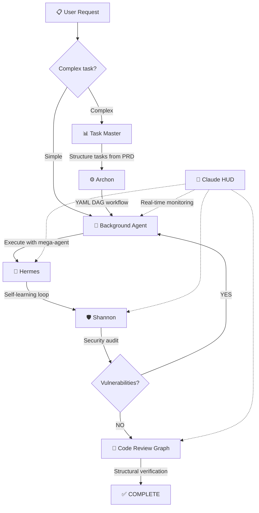
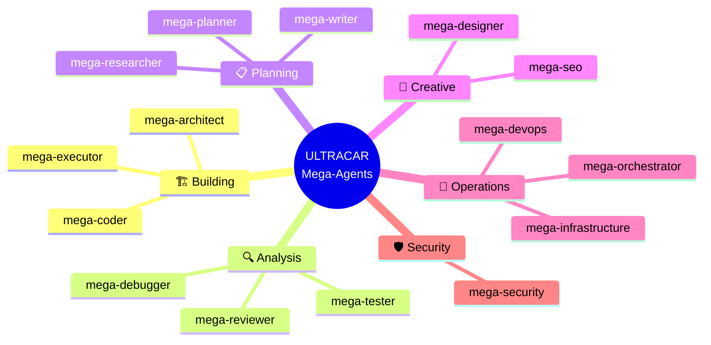
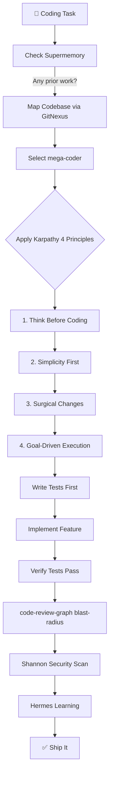
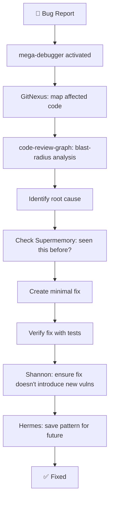
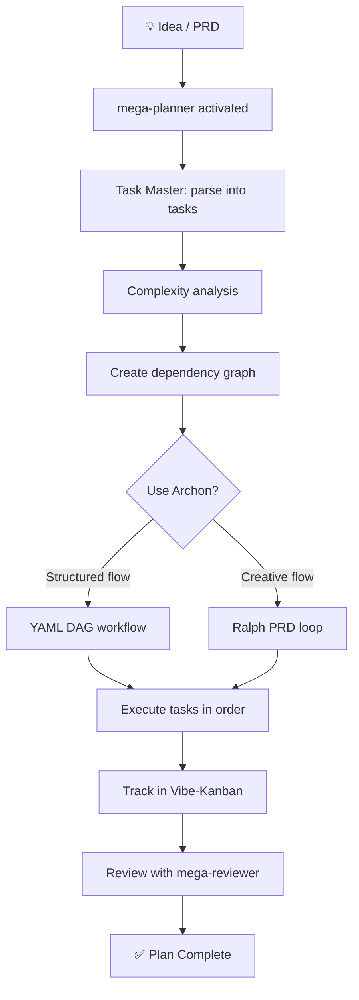
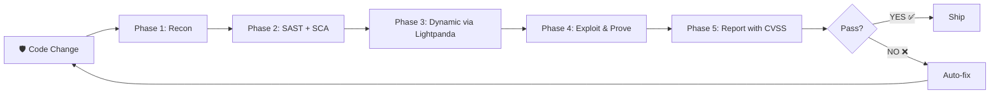
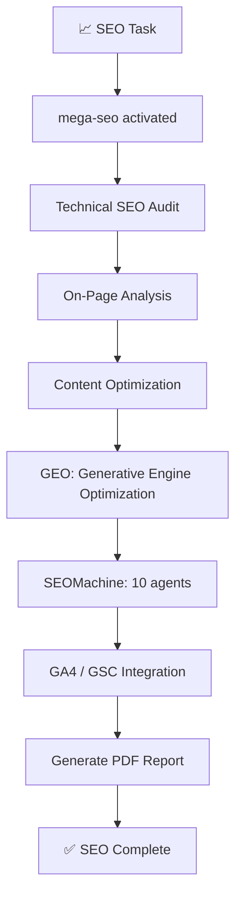

---
tags:
  - domain/skills
  - artifact/doc
  - source/root
---

<div align="center">

# 🎯 ULTRACAR v3.0 — Vibe-Coder Arsenal

### The World's Most Powerful Open-Source AI Coding System

*54 repositories. 15 mega-agents. 23 orchestration systems. Zero coding knowledge required.*

[](https://github.com/ibragimov-oasis/vibe-coder/stargazers)
[](LICENSE)
[](https://github.com/ibragimov-oasis)
[](AGENTS.md)

**⭐ If this saved you hours of searching — drop a star. It took me months to build.**

---

[📖 My Story](#-my-story) · [🏗️ System Architecture](#%EF%B8%8F-system-architecture) · [⚡ How It Works](#-how-it-works) · [🗂️ All 54 Repos](#%EF%B8%8F-all-54-repositories) · [🚀 How to Use](#-how-to-use) · [💛 Support](#-support-this-project)

</div>

---

## 📖 My Story

I'm a law student in Japan. I don't know how to code — not a single line. But I build websites.

It started when I realized my university email gave me access to **GitHub Education Pack** and **GitHub Copilot**. I opened VS Code, typed a prompt, and watched AI write my first website.

But here's what nobody tells you about vibe-coding: **you spend more time searching for the right tools than actually building.**

Every day after classes I was doing the same thing — opening GitHub Trending, scrolling TikTok and Instagram for AI coding tips, finding a repo someone mentioned, reading through it, figuring out if it's useful, downloading it, testing it. Most were tutorials or books — useless for a vibe-coder. I needed things that **make AI smarter, not me**.

Then I did something nobody else bothered to do:

1. **Downloaded** every useful repo (they're all public, MIT/open-source)
2. **Made hidden files visible** (`.claude`, `.github`, `.cursorrules` — the real gold is always hidden)
3. **Removed the clutter** — deleted promo videos, contributor photos, redundant docs
4. **Combined everything** into one unified system

**54 repositories. Months of daily research. One autonomous AI coding machine.**

This is the toolkit I wish existed when I started. Now it's yours.

> I'm still saving up for **Claude Code** ($200/month, ~$2,400/year). If this repo helps you — even a little — consider [supporting me](#-support-this-project). Every donation gets me closer to making this collection even better.

---

## 🏗️ System Architecture

ULTRACAR is not just a collection of repos — it's a **unified autonomous system** where every part knows about every other part. Here's the big picture:

### System Overview

```
┌─────────────────────────────────────────────────────────────────────┐
│                    ULTRACAR v3.0 — 54 Repositories                  │
├─────────────────────────────────────────────────────────────────────┤
│                                                                     │
│  ┌──────────────────────────────────────────────────────────────┐   │
│  │  🧠 BRAIN — Configuration Layer                              │   │
│  │  AGENTS.md · CAPABILITIES.md · PIPELINE.md · PIPELINE_TRIGGER │   │
│  │  INTERFACE_MATRIX.md                                           │   │
│  │  ┌────────────────────────────────────────────────────────┐   │   │
│  │  │  IDE Configs (all identical ULTRACAR v3.0 identity)     │   │   │
│  │  │  .claude/ · .cursor/ · .github/ · .codex/ · .gemini/   │   │   │
│  │  │  .antigravity/                                          │   │   │
│  │  └────────────────────────────────────────────────────────┘   │   │
│  └──────────────────────────────────────────────────────────────┘   │
│                                                                     │
│  ┌──────────────────────────────────────────────────────────────┐   │
│  │  🤖 AGENTS — 15 Mega-Agents                                  │   │
│  │  orchestrator · debugger · planner · researcher · designer   │   │
│  │  security · seo · reviewer · tester · architect              │   │
│  │  coder · executor · writer · devops · infrastructure         │   │
│  └──────────────────────────────────────────────────────────────┘   │
│                                                                     │
│  ┌──────────────────────────────────────────────────────────────┐   │
│  │  🔄 ORCHESTRATION — 23 Systems                                │   │
│  │  RuFlo · GSD · OMC · DeerFlow · Hermes · Background Agents  │   │
│  │  Superpowers · Vibe-Kanban · 1Code · Terraform               │   │
│  │  Archon · Ralph · Squad · Multica · PraisonAI                │   │
│  │  cc-connect · Task Master · Refly                            │   │
│  └──────────────────────────────────────────────────────────────┘   │
│                                                                     │
│  ┌───────────────┐  ┌───────────────┐  ┌───────────────────────┐   │
│  │ 🛡️ SECURITY   │  │ 🧠 MEMORY     │  │ 🔌 MCP SERVERS        │   │
│  │ Shannon Pro   │  │ Supermemory   │  │ ✅ 9 configured       │   │
│  │ Code Review   │  │ Claude-Mem    │  │ Lightpanda · GitNexus │   │
│  │ Graph         │  │ OpenViking    │  │ mcp-toolbox · markit  │   │
│  └───────────────┘  └───────────────┘  │ code-review-graph     │   │
│                                         │ ⚠️ 3 planned          │   │
│                                         └───────────────────────┘   │
│  ┌───────────────┐  ┌───────────────┐  ┌───────────────────────┐   │
│  │ 🎨 DESIGN     │  │ 📚 SKILLS     │  │ 💬 PROMPTS            │   │
│  │ Galaxy 3000+  │  │ 3,000+ skills │  │ 4,000+ prompts        │   │
│  │ shadcn/ui     │  │ 24 categories │  │ 30+ AI system prompts │   │
│  │ Impeccable    │  │ Karpathy      │  │ 500+ cursor rules     │   │
│  │ Taste-skill   │  │ Matt Pocock   │  │ 35+ prompt archives   │   │
│  │ Stitch        │  │ 69 practices  │  │                       │   │
│  │ UI/UX ProMax  │  │               │  │                       │   │
│  └───────────────┘  └───────────────┘  └───────────────────────┘   │
│                                                                     │
└─────────────────────────────────────────────────────────────────────┘
```

### Numbers at a Glance

| What | Count | Details |
|:-----|------:|:--------|
| Repositories | **54** | All open-source, all integrated |
| Mega-Agents | **15** | One for every task type |
| Orchestration Systems | **23** | From lightweight to enterprise swarms |
| Memory Systems | **3** | Short-term, long-term, codebase |
| MCP Servers | **9 active + 3 planned** | Browser, DB, images, files, code analysis |
| UI Components | **3,000+** | Galaxy + shadcn/ui + Stitch |
| Design Rules | **200+** | UI/UX Pro Max + Impeccable + Taste-skill |
| Skills | **3,000+** | 24 categories |
| Prompts & Templates | **4,000+** | System prompts, cursor rules, templates |
| IDE Configurations | **6** | Claude, Copilot, Cursor, Codex, Gemini, Antigravity |

---

## ⚡ How It Works

### The Extended Pipeline

Every task goes through this autonomous pipeline. No manual intervention needed:



### Pipeline Steps Explained

| Step | System | What Happens |
|:-----|:-------|:-------------|
| **Step 0** | 🗂️ **Task Master** | Parses your request (or PRD) into structured tasks. Analyzes complexity. Creates execution order with dependencies. 36 MCP tools available. Merged with Vibe-Kanban for visual tracking. |
| **Step 0.5** | ⚙️ **Archon** *(optional)* | Loads a YAML workflow (17 built-in or custom). Builds a deterministic DAG from task dependencies. Executes: plan → implement → validate → PR. Complements the Background Agent for structured flows. |
| **Step 1** | 🤖 **Background Agent** | The main executor. Reads CAPABILITIES.md, checks Supermemory for prior work, maps codebase via GitNexus, selects the right mega-agent, and executes. Enhanced with Ralph (PRD loop), PraisonAI (multi-agent), Squad (team), Multica (platform). Applies Karpathy 4 principles + 69 best practices. |
| **Step 2** | 🧠 **Hermes** | Self-learning loop. Analyzes what worked, what failed, what was novel. Extracts reusable patterns. Creates skills in `COMBINED/skills/`. Updates Supermemory. Registers in Refly skills registry. |
| **Step 3** | 🛡️ **Shannon** | Full security audit. Static analysis (SAST + SCA) + code-review-graph blast-radius analysis + dynamic attacks via Lightpanda (XSS, SQLi, SSRF, auth bypass). Generates CVSS-rated vulnerability report. If vulnerabilities found → back to Step 1. Max 3 retries. |
| **Step 4** | 📐 **Code Review Graph** | Structural verification. Builds code graph (19 languages, Tree-sitter). Blast-radius analysis (8.2x token reduction). Dead code detection. Architecture overview. Risk-scored review. |
| **Always On** | 📡 **Claude HUD** | Real-time monitoring: context health, tool activity, agent status, todo progress, session cost, git status. |

---

## 🤖 The 15 Mega-Agents

Every task starts by picking the right agent. Each mega-agent is a unified combination of the best strategies from multiple repos:



| Agent | When to Use | Combined From |
|:------|:------------|:-------------|
| **mega-orchestrator** | Running the full pipeline, routing tasks | RuFlo + GSD + OMC + Archon + Ralph + Squad + Multica + PraisonAI + Task Master + Refly |
| **mega-coder** | Writing code, building features | RuFlo + OMC + Superpowers + Claude-Skills + PraisonAI + Karpathy + 69 best practices |
| **mega-debugger** | Fixing bugs, investigating errors | GSD + OMC + RuFlo + Superpowers + code-review-graph blast-radius |
| **mega-planner** | Architecture, roadmaps, PRDs | GSD + OMC + RuFlo + Ralph + Matt Pocock PRD skills + Task Master |
| **mega-researcher** | Deep research, web analysis | Hermes + GSD + DeerFlow + PraisonAI + markitdown |
| **mega-designer** | UI/UX, design systems | Galaxy + shadcn + Impeccable + Taste-skill + Stitch + UI/UX Pro Max |
| **mega-security** | Pentesting, vulnerability scanning | Shannon Pro (35k⭐) + code-review-graph structural analysis |
| **mega-seo** | SEO audits, content marketing | Claude-SEO + SEOMachine (10 agents, 26 marketing skills, GA4/GSC) |
| **mega-reviewer** | Code review across 7 quality dimensions | RuFlo + OMC + Superpowers + code-review-graph (8.2x token reduction) |
| **mega-tester** | Testing, TDD, coverage analysis | OMC + GSD + RuFlo + Superpowers + Matt Pocock TDD |
| **mega-architect** | System design, ADRs | OMC + RuFlo + GSD + Matt Pocock architecture + code-review-graph |
| **mega-executor** | Executing plans precisely | OMC + GSD + Ralph PRD loop + Archon YAML + Task Master MCP |
| **mega-writer** | Documentation, README, API docs | OMC + RuFlo + markitdown + Matt Pocock edit-article |
| **mega-devops** | Git, CI/CD, deployment | OMC + RuFlo DevOps + git-guardrails + cc-connect |
| **mega-infrastructure** | Swarm coordination, consensus | RuFlo (80+ agents) + Squad + Multica |

---

## 🎨 Design Workflow — Step by Step

When the system gets a UI/design task, here's the exact flow:


| Step | Tool | What It Does | Location |
|:-----|:-----|:-------------|:---------|
| **1** | **Galaxy** (Uiverse.io) | Search 3,000+ ready-made UI components: buttons, cards, forms, loaders, toggles, notifications, tooltips | `COMBINED/ui-design/ui-components-galaxy/` |
| **2** | **shadcn/ui** | Accessible, customizable React components. The most popular component library. | `COMBINED/ui-design/ui-components-shadcn/` |
| **3** | **Impeccable** | Anti-slop design enforcement. 18 commands + 7 references. Detects AI design mistakes: gray text, Inter font abuse, purple gradients, nested cards, bounce easing. | `COMBINED/ui-design/ui-impeccable/` |
| **4** | **Taste-skill** | 7 premium frontend skills with 3 dials: `DESIGN_VARIANCE`, `MOTION_INTENSITY`, `VISUAL_DENSITY`. Skills: taste, redesign, soft, output, minimalist, brutalist, stitch. | `COMBINED/ui-design/ui-taste-skill/` |
| **5** | **Stitch Skills** | Google Stitch design generation. React component synthesis, prompt enhancement, DESIGN.md creation, remotion videos. | `COMBINED/ui-design/ui-stitch-skills/` |
| **6** | **UI/UX Pro Max** | 161 reasoning rules + 67 styles. Covers accessibility, touch targets, breakpoints, animation, performance, and more. | `COMBINED/ui-design/ui-rules/ui-ux-pro-max/` |
| **7** | **Custom** | Only if steps 1-6 have nothing suitable. Must document why. | — |

**Key Design Rules (auto-enforced):**
- Contrast ratio ≥ 4.5:1
- Touch targets ≥ 44×44pt
- Mobile-first breakpoints: 375 / 768 / 1024 / 1440
- Animations 150-300ms, transform/opacity only
- `prefers-reduced-motion` respected
- Images: WebP/AVIF with width/height for CLS < 0.1

---

## 💻 Coding Workflow — Step by Step

When the system gets a coding task:



**The 4 Karpathy Principles (embedded in ALL agents):**

| Principle | What It Means | Prevents |
|:----------|:-------------|:---------|
| **Think Before Coding** | State assumptions, present tradeoffs, stop when confused | Wrong assumptions, hidden confusion |
| **Simplicity First** | Minimum code that solves the problem. No speculative features. | Over-engineering, bloated abstractions |
| **Surgical Changes** | Every changed line traces to the user's request | Touching code you shouldn't, scope creep |
| **Goal-Driven Execution** | Write tests first, define success criteria, loop until verified | Shipping untested code |

---

## 🔍 Debugging Workflow — Step by Step



---

## 📋 Planning Workflow — Step by Step

When starting a new project or feature:



**Matt Pocock planning skills available:**
- `write-a-prd` — Generate a Product Requirements Doc
- `prd-to-plan` — Convert PRD to implementation plan
- `prd-to-issues` — Convert PRD to GitHub issues
- `grill-me` — Stress-test your idea before building
- `design-an-interface` — Design system from requirements

---

## 🛡️ Security Workflow — Step by Step

Shannon Pro runs a 5-phase white-box pentest:



| Phase | What Happens |
|:------|:-------------|
| **Recon** | Map attack surface from source code |
| **SAST + SCA** | Static analysis + dependency vulnerability scan |
| **Dynamic** | Launch real attacks via Lightpanda browser: XSS, SQLi, SSRF, auth bypass, IDOR |
| **Exploit** | Prove vulnerabilities with working exploits |
| **Report** | CVSS-rated report with fix recommendations |

---

## 📈 SEO Workflow — Step by Step



**SEOMachine provides 26 marketing skills:** copywriting, content-strategy, pricing, CRO, social-media, email-marketing, brand-voice, A/B testing, and more.

---

## 🔌 MCP Servers

MCP (Model Context Protocol) servers extend AI capabilities:

### ✅ 9 Configured and Ready

| Server | Purpose | Why You Need It |
|:-------|:--------|:---------------|
| 🌐 **Lightpanda** | Headless browser | **MANDATORY** for all web tasks. 9× faster than Chrome, 16× less memory. Written in Zig. |
| 🗺️ **GitNexus** | Codebase analysis | Indexes your code into a knowledge graph — dependencies, call chains, clusters, flows. |
| 🧠 **Supermemory** | Long-term memory | #1 on LongMemEval, LoCoMo, ConvoMem benchmarks. Remembers everything across sessions. |
| 📂 **OpenViking** | Codebase context | ByteDance's context database. Unified memory for resources and skills. |
| 🖼️ **Nano-Banana** | Image generation | MCP server for Gemini image gen. 1K–4K resolution, aspect ratio control. |
| 🗄️ **mcp-toolbox** | Database access | PostgreSQL, MySQL, BigQuery, MongoDB, Redis, Elasticsearch, CockroachDB, ClickHouse, Snowflake, Neo4j, Oracle — 20+ databases. |
| 📄 **markitdown** | File conversion | PDF, DOCX, XLSX, PPTX, images, audio, HTML, ZIP → clean Markdown. |
| 📊 **code-review-graph** | Code structure | AST analysis with 8.2x token reduction. 19 languages. 22 MCP tools. Blast-radius. Dead code detection. |
| 🔧 **claude-flow** | Agent teams | Claude Code exclusive — swarm coordination, agent teams. |

### ⚠️ 3 Planned — Not Yet Configured

| Server | Purpose | Status |
|:-------|:--------|:-------|
| 📐 **Pretext** | Text layout | ⚠️ PLANNED — not yet configured in any interface |
| 📋 **Task Master** | Task management | ⚠️ PLANNED — AI-driven: PRD→tasks→dependencies. 36 MCP tools. |
| ⚙️ **Archon** | YAML workflows | ⚠️ PLANNED — 17 deterministic workflows. DAG execution. |

---

## 🔄 23 Orchestration Systems

From lightweight single-agent to enterprise swarms:

| System | Stars | Best For | Key Feature |
|:-------|------:|:---------|:------------|
| **RuFlo** | 29k⭐ | Enterprise swarms | Q-Learning Router, 100+ agents, fault-tolerant |
| **GSD** | 46k⭐ | Spec-driven dev | Context engineering, phased execution |
| **OMC** | — | Multi-agent teams | 19 agents, plan → PRD → exec → verify → fix |
| **DeerFlow** | 55k⭐ | Deep research | ByteDance, LangGraph + FastAPI |
| **Hermes** | — | Self-learning | Pattern extraction, skill creation |
| **Background Agents** | — | Async execution | Cloud sandboxed environments |
| **Superpowers** | 129k⭐ | TDD workflow | Composable skills, autonomous builds |
| **Vibe-Kanban** | — | Task management | Kanban boards + coding agents (merged with Task Master) |
| **1Code** | — | Lightweight | Simple orchestration, desktop app |
| **Terraform** | — | Infrastructure | Terraform-as-code workflows |
| **Archon** | 17k⭐ | YAML workflows | 17 deterministic DAGs, fire-and-forget |
| **Ralph** | — | PRD-driven loop | progress.txt, fresh context per iteration |
| **Squad** | — | AI teams | Named agents, casting, watch mode, decisions archive |
| **Multica** | — | Agent platform | Agents as teammates, board view, multi-workspace |
| **PraisonAI** | — | Multi-agent | 100+ LLMs, route/parallel/loop/repeat, MCP |
| **cc-connect** | — | Remote access | 7 AI agents × 10 chat platforms (Telegram, Slack, Discord…) |
| **Task Master** | — | Task management | MCP-based, PRD→tasks, 36 tools, complexity analysis |
| **Refly** | — | Skills builder | Visual workflow → executable skill → export to MCP |

---

## 📚 3,000+ Skills in 24 Categories

| Category | Path | What You Get |
|:---------|:-----|:-------------|
| **Claude** | `skills-claude/` | Karpathy 4 principles + 69 best practices + coding patterns |
| **Development** | `skills-development/` | Matt Pocock 20 skills: TDD, triage, git-guardrails, scaffold-exercises |
| **Planning** | `skills-planning/` | write-a-prd, prd-to-plan, prd-to-issues, grill-me, design-an-interface |
| **Design** | `skills-design/` | Impeccable + Taste-skill: 25 design skills |
| **SEO** | `skills-seo/` | SEOMachine (10 agents, 26 marketing skills), audit, technical SEO, GEO |
| **Writing** | `skills-writing/` | edit-article, write-a-skill, ubiquitous-language |
| **RuFlo** | `skills-ruflo/` | Enterprise orchestration patterns |
| **Superpowers** | `skills-superpowers/` | TDD, systematic dev, composable workflows |
| **OMC** | `skills-omc/` | Multi-agent coordination |
| **DevOps** | `skills-devops/` | CI/CD, deployment, infrastructure |
| **Research** | `skills-research/` | Deep research methodologies |
| **Hermes** | `skills-hermes/` | Self-learning patterns |
| **DeerFlow** | `skills-deer-flow/` | Research agent skills |
| **Antigravity** | `skills-antigravity/` | IDE plugin skills |
| **Awesome Claude** | `skills-awesome-claude/` | Curated community skills |
| **Background** | `skills-background/` | Async execution skills |
| **Business** | `skills-business/` | Business & growth |
| **Copilot** | `skills-copilot/` | GitHub Copilot skills |
| **Data Analysis** | `skills-data-analysis/` | Data processing |
| **Everything CC** | `skills-everything-cc/` | Enterprise patterns |
| **Platform** | `skills-platform/` | Platform & meta skills |
| **Stitch** | `skills-stitch/` | Google Stitch design generation |

All in `COMBINED/skills/`

---

## 🎯 Capability Map — What Do I Need?

| I want to... | Agent | Tools | Skills |
|:-------------|:------|:------|:-------|
| **Build a feature** | mega-coder | GitNexus, OpenViking, code-review-graph | skills-claude, skills-development |
| **Fix a bug** | mega-debugger | GitNexus, Lightpanda, code-review-graph | skills-claude |
| **Plan a project** | mega-planner | GitNexus, Supermemory, Task Master | skills-planning |
| **Research a topic** | mega-researcher | Lightpanda, Supermemory, markitdown | skills-research |
| **Design a UI** | mega-designer | Nano-Banana, Lightpanda | skills-design, Galaxy, shadcn |
| **Audit security** | mega-security | Lightpanda, GitNexus, code-review-graph | Shannon Pro |
| **Optimize SEO** | mega-seo | Lightpanda, Supermemory | skills-seo, SEOMachine |
| **Review code** | mega-reviewer | GitNexus, Supermemory, code-review-graph | skills-claude |
| **Write tests** | mega-tester | GitNexus, code-review-graph | skills-development (TDD) |
| **Execute a plan** | mega-executor | GitNexus, OpenViking, Archon, Task Master | skills-planning |
| **Write docs** | mega-writer | GitNexus, markitdown | skills-writing |
| **Deploy** | mega-devops | GitNexus, cc-connect | skills-devops |
| **Coordinate agents** | mega-infrastructure | GitNexus, Squad, Multica | skills-ruflo |
| **Manage tasks** | mega-orchestrator | Task Master, Archon, Vibe-Kanban | skills-planning |
| **Access remotely** | mega-orchestrator | cc-connect | — |
| **Query databases** | mega-coder | mcp-toolbox (20+ DBs) | — |
| **Convert files** | mega-researcher | markitdown (PDF, DOCX, images, audio) | — |
| **Run full pipeline** | mega-orchestrator | ALL tools | ALL skills |

---

## 🗂️ All 54 Repositories

### Category 1: 🤖 Agents (3)

| # | Project | Stars | What It Does |
|:-:|:--------|------:|:-------------|
| 1 | **Background Agents** | — | Hosted background coding agent. Creates PRs while you sleep. |
| 2 | **Hermes Agent** | — | Self-improving AI by Nous Research. Built-in learning loop, Telegram/Discord/Slack. |
| 3 | **Shannon** | 35k⭐ | AI pentester. Source code analysis → vulnerability discovery → real exploits. |

### Category 2: 🎼 Orchestration (18)

| # | Project | Stars | What It Does |
|:-:|:--------|------:|:-------------|
| 4 | **1Code** | — | Desktop app for Claude Code, Codex with kanban, browser previews. |
| 5 | **DeerFlow** | 55k⭐ | ByteDance's super agent harness. #1 GitHub Trending. |
| 6 | **Get Shit Done (GSD)** | 46k⭐ | Meta-prompting system. Solves context rot. Amazon, Google, Shopify engineers use it. |
| 7 | **oh-my-claudecode (OMC)** | — | Multi-agent orchestration. Zero learning curve. |
| 8 | **RuFlo (Claude Flow)** | 29k⭐ | Enterprise AI orchestration. 100+ agents, Q-Learning Router, 6,000+ commits. |
| 9 | **Superpowers** | 129k⭐ | Complete dev workflow in skills. Specs, plans, sub-agents — autonomous for hours. |
| 10 | **Vibe Kanban** | — | Kanban board for coding agents. Plan → run → review → preview. Merged with Task Master. |
| 11 | **Archon** | 17k⭐ | YAML workflow engine. 17 deterministic DAGs. Fire-and-forget AI coding. |
| 12 | **Ralph** | — | PRD-driven autonomous loop. Fresh context per iteration, progress.txt tracking. |
| 13 | **Squad** | — | AI team via GitHub Copilot. Named agents, casting, watch mode, decisions archive. |
| 14 | **Multica** | — | Agent platform. Agents as teammates. Board view, multi-workspace. |
| 15 | **PraisonAI** | — | Multi-agent framework. 100+ LLMs, route/parallel/loop/repeat, MCP, guardrails. |
| 16 | **cc-connect** | — | Remote AI access. 7 agents × 10 chat platforms. Telegram, Slack, Discord, WeChat. |
| 17 | **Claude-Task-Master** | — | MCP task management. PRD→tasks→dependencies. 36 tools, complexity analysis. |
| 18 | **Refly** | — | Skills builder platform. Visual workflow → executable skill → export to Claude/Cursor/MCP. |

### Category 3: 💬 Prompts & References (7)

| # | Project | Stars | What It Does |
|:-:|:--------|------:|:-------------|
| 19 | **prompts.chat** | 143k⭐ | World's largest open-source prompt library. Forbes-featured. |
| 20 | **System Prompts & Models** | — | Leaked system prompts from Claude, ChatGPT, Cursor, Copilot, and more. |
| 21 | **System Prompts Leaks** | — | Another collection. Continuously updated. |
| 22 | **Vibe-Coding Prompt Template** | — | Structured prompts for shipping MVPs. |
| 23 | **Awesome Self-Hosted** | — | Massive list of self-hostable tools and services. |
| 24 | **awesome-ai-system-prompts** | — | 30+ AI tool system prompts (Cursor, Claude, Devin, Manus, v0, Windsurf). |
| 25 | **awesome-cursorrules** | — | 500+ curated .cursorrules files for every framework and language. |

### Category 4: 🧠 Skills (12)

| # | Project | Stars | What It Does |
|:-:|:--------|------:|:-------------|
| 26 | **Antigravity Awesome Skills** | 29k⭐ | 1,340+ skills for Claude, Gemini, Cursor, Copilot. One command install. |
| 27 | **Awesome Claude Code** | — | Curated list of skills, agents, plugins, hooks for Claude Code. |
| 28 | **Awesome Copilot** | — | Agents, instructions, skills for GitHub Copilot. |
| 29 | **Claude SEO** | — | SEO audit skill: technical SEO, E-E-A-T, schema markup, PDF reports. |
| 30 | **Claude Skills** | 5.2k⭐ | 205 skills + 16 agents + 3 personas. 268 Python CLI scripts. |
| 31 | **Everything Claude Code** | 50k⭐ | Performance optimization. Anthropic Hackathon Winner. |
| 32 | **Obsidian Skills** | — | Agent skills for Obsidian: markdown, JSON canvas, CLI. |
| 33 | **claude-code-best-practice** | — | 69 tips, agent teams, orchestration workflows. |
| 34 | **skills (Matt Pocock)** | — | 20 skills: write-a-prd, TDD, triage, grill-me, git-guardrails, design-interface. |
| 35 | **andrej-karpathy-skills** | — | 4 principles: Think Before Coding, Simplicity, Surgical, Goal-Driven. |
| 36 | **SEOMachine** | — | 10 SEO agents, 26 marketing skills, GA4/GSC/DataForSEO, WordPress publishing. |
| 37 | **system-prompts-and-models** | — | 35+ AI tool prompt archive (Google, Anthropic, OpenAI). |

### Category 5: 🔧 Tools & MCP Servers (11)

| # | Project | Stars | What It Does |
|:-:|:--------|------:|:-------------|
| 38 | **GitNexus** | — | Indexes codebase into knowledge graph: dependencies, call chains, clusters. |
| 39 | **OpenViking** | — | ByteDance's context database for AI agents. Unified memory. |
| 40 | **Lightpanda Browser** | — | Headless browser for AI agents. Zig. 9× faster, 16× less memory than Chrome. |
| 41 | **Claude-Mem** | — | Persistent memory compression. Remembers across sessions. |
| 42 | **Nano Banana 2 MCP** | — | MCP server for Gemini image gen. 1K–4K resolution. |
| 43 | **Pretext** | — | Pure JS/TS text measurement. No DOM reflow. All languages. |
| 44 | **Supermemory** | — | #1 on LongMemEval, LoCoMo benchmarks. Auto-learns from conversations. |
| 45 | **code-review-graph** | — | AST analysis. 8.2x token reduction. 19 languages. 22 MCP tools. |
| 46 | **mcp-toolbox** | — | Database access: PostgreSQL, MySQL, BigQuery, MongoDB, Redis — 20+ databases. |
| 47 | **mcp-toolbox-sdk** | — | Database SDKs: Python, JS/TS, Go, Java. LangChain, LlamaIndex, ADK, Genkit. |
| 48 | **markitdown** | — | File→Markdown: PDF, DOCX, XLSX, PPTX, images, audio, HTML, ZIP. |

### Category 6: 🎨 UI/UX & Design (6)

| # | Project | Stars | What It Does |
|:-:|:--------|------:|:-------------|
| 49 | **Galaxy (Uiverse.io)** | — | 3,000+ unique UI elements. Buttons, cards, loaders, toggles. All MIT. |
| 50 | **shadcn/ui** | — | The most popular React component library. Beautiful, open source. |
| 51 | **UI UX Pro Max** | — | 161 reasoning rules + 67 styles for AI-generated UIs. |
| 52 | **Impeccable** | — | Anti-slop design. 18 commands, 7 references. Fights AI design mistakes. |
| 53 | **Taste-skill** | — | 7 premium frontend skills. 3-dial parameterization. |
| 54 | **Stitch Skills** | — | Google Stitch design generation. React components, DESIGN.md synthesis. |

### Category 7: 📡 Monitoring (1)

| # | Project | What It Does |
|:-:|:--------|:-------------|
| — | **Claude HUD** | Real-time monitoring: context, tools, agents, todos, cost, git status. |

---

## 📂 Full Directory Structure

```
vibe-coder/
├── README.md                    ← YOU ARE HERE
├── AGENTS.md                    ← Universal agent catalog (all 6 IDEs read this)
├── CAPABILITIES.md              ← Complete rules and capability registry
├── PIPELINE.md                  ← Extended autonomous pipeline specification
├── PIPELINE_TRIGGER.md          ← Agent routing decision tree + post-task pipeline
├── INTERFACE_MATRIX.md          ← What tools/MCP/skills work in which interface
├── MEMORY_SETUP.md              ← Memory system configuration guide
│
├── .claude/                     ← Claude Code
│   ├── CLAUDE.md                   Master ULTRACAR v3.0 identity
│   ├── agents/                     15 mega-agents
│   ├── skills/                     39+ specialized skills
│   ├── commands/                   Slash commands
│   ├── helpers/                    Hook scripts (session, memory, pipeline)
│   └── settings.json               12 MCP servers + hooks + permissions
│
├── .github/                     ← GitHub Copilot
│   ├── copilot-instructions.md     ULTRACAR v3.0 instructions + Squad
│   ├── agents/                     Copilot agent files (.agent.md)
│   └── prompts/                    Reusable prompts (.prompt.md)
│
├── .cursor/                     ← Cursor AI
│   ├── rules/                      8 rule files (.mdc) — auto-attached (incl. pipeline + testing)
│   └── mcp.json                    MCP server configs
│
├── .codex/                      ← OpenAI Codex
│   └── AGENTS.md                   ULTRACAR v3.0 identity
│
├── .gemini/                     ← Google Gemini CLI
│   └── GEMINI.md                   ULTRACAR v3.0 identity
│
├── .antigravity/                ← Antigravity
│   └── AGENTS.md                   ULTRACAR v3.0 identity
│
└── COMBINED/                    ← All content from 54 repositories
    ├── agents/
    │   ├── mega/                    15 MEGA AGENTS (start here)
    │   ├── by-role/                 19 role categories (336+ agents)
    │   └── by-interface/            6 IDE-specific agent sets
    │
    ├── skills/                      3,000+ skills across 24 categories
    │   ├── skills-claude/              Best practices + Karpathy
    │   ├── skills-development/         Matt Pocock 20 skills
    │   ├── skills-seo/                 SEO + SEOMachine
    │   └── ... (21 more)
    │
    ├── orchestration/               23 orchestration systems
    │   ├── core-archon/                YAML workflows (17 DAGs)
    │   ├── core-taskmaster/            MCP tasks (36 tools)
    │   ├── core-ralph/                 PRD autonomous loop
    │   ├── core-ruflo/                 Enterprise (100+ agents)
    │   ├── core-gsd/                   Spec-driven dev
    │   ├── core-omc/                   Multi-agent teams
    │   └── ... (17 more)
    │
    ├── security/
    │   └── security-shannon/           Shannon pentester (full source)
    │
    ├── memory/                      Memory systems
    │   ├── memory-claude-mem/          Compression memory
    │   └── memory-supermemory/         Long-term memory
    │
    ├── mcp-servers/                 12 MCP server configs
    │   ├── mcp-lightpanda/             AI browser (9× faster)
    │   ├── mcp-toolbox/                20+ databases
    │   ├── mcp-markitdown/             File→Markdown
    │   ├── mcp-code-review-graph/      Code structure (8.2x)
    │   └── ... (8 more)
    │
    ├── ui-design/                   Complete design system
    │   ├── ui-components-galaxy/       3,000+ components
    │   ├── ui-components-shadcn/       React components
    │   ├── ui-impeccable/              Anti-slop (18 cmds)
    │   ├── ui-taste-skill/             7 premium skills
    │   ├── ui-stitch-skills/           Google Stitch
    │   └── ui-rules/ui-ux-pro-max/     161 rules
    │
    ├── prompts/                     4,000+ prompts
    │   ├── prompts-ai-systems/         30+ AI system prompts
    │   ├── prompts-system-models/      35+ prompt archives
    │   └── prompts-templates/          Reusable templates
    │
    └── reference/                   Reference materials
        ├── claude-hud/                 Real-time monitoring
        ├── cursorrules/                500+ .cursorrules files
        └── awesome-selfhosted/         Self-hosted tools list
```

---

## 🚀 How to Use

### Option 1: Clone Everything

```bash
git clone https://github.com/ibragimov-oasis/vibe-coder.git
```

You get **all 54 projects** organized and integrated. All hidden files (`.claude`, `.cursorrules`, `.github`) are included — the ULTRACAR system activates automatically in supported IDEs.

### Option 2: Cherry-Pick What You Need

Browse the categories above, find what you need, and grab individual folders.

### Option 3: Let AI Do It

Copy this prompt to your AI coding assistant:

```
Read PIPELINE_TRIGGER.md first — it has the agent routing decision tree.
Then read CAPABILITIES.md for full rules. Use the mega-agent system to 
handle my task. Check INTERFACE_MATRIX.md for what tools work in your IDE.
After completing the task, follow the post-task pipeline in PIPELINE_TRIGGER.md.
```

### 💡 Quick Start for Each IDE

| IDE | What Happens |
|:----|:-------------|
| **Claude Code** | Reads `.claude/CLAUDE.md` automatically. Full ULTRACAR v3.0 identity activates. 12 MCP servers available. |
| **GitHub Copilot** | Reads `.github/copilot-instructions.md`. All mega-agents available as Copilot agents. Squad integration is native. |
| **Cursor** | Reads `.cursor/rules/*.mdc` automatically. 6 rule files attach to all files. MCP servers via `.cursor/mcp.json`. |
| **OpenAI Codex** | Reads `.codex/AGENTS.md`. ULTRACAR v3.0 identity and pipeline available. |
| **Gemini CLI** | Reads `.gemini/GEMINI.md`. Nano-banana image gen works natively with Gemini. |
| **Antigravity** | Reads `.antigravity/AGENTS.md`. ULTRACAR v3.0 identity and pipeline available. |

---

## 💛 Support This Project

I'm a student. I built this after classes, between homework and exams. No sponsors, no company behind this — just months of daily research on GitHub Trending, TikTok, Instagram, and countless README files.

**My goal:** Get a Claude Code subscription (~$200/month) so I can make this collection even better and build more tools for the vibe-coding community.

### Donate via Binance

> **Binance Pay ID:** `493322270`
>
> **USDT (TRC-20):** `TQRpzwLXDrv8FTs9BiSGmKnUJ79HQHFkyo`
>
> **BNB (BSC):** `0xe7978841f84e2e48115a5fff8490b0910f041ba`
> 
> **BTC (BSC):** `0xe7978841f84e2e48115a5fff8490b0910f041baf`
> 
> **BTC (BTC):** `1NAX3vZpZZRhp6G1RxH4KjcAGoGYyz2WVQ`

### Other Ways to Help

- ⭐ **Star this repo** — it's free and helps others find it
- 🔀 **Fork & share** — spread the word
- 📢 **Post about it** — tag me on Twitter/X, TikTok, or Instagram
- 🐛 **Report issues** — help improve the collection

---

## 🤝 Contributing

Want to add a repo to this collection? Here's how:

### Rules

1. **Must be useful for vibe-coders** — tools that make AI smarter, not tutorials that require you to learn coding
2. **Must be open-source** — MIT, Apache 2.0, or similar permissive license
3. **Must have significant stars** — proof that the community finds it valuable
4. **No books, courses, or "learn to code" repos** — we're vibe-coders, not traditional devs

### How to Contribute

1. Fork this repo
2. Add the new project to the correct `COMBINED/` category folder
3. Update `AGENTS.md` with the new project entry
4. Update `CAPABILITIES.md` if it adds new capabilities
5. Update this `README.md` with the new project description
6. Submit a Pull Request with:
   - Project name and link to original repo
   - One-line description of what it does
   - Why it's useful for vibe-coders

---

## 🙏 Credits & Gratitude

This repo exists because of the incredible open-source community. Every project here was built by talented developers who chose to share their work publicly. **Thank you.**

<details>
<summary><b>View all 54 credits</b></summary>

| # | Creator / Organization | Project | Link |
|:-:|:----------------------|:--------|:-----|
| 1 | nichochar | Background Agents | [Repo](https://github.com/nichochar/open-inspect) |
| 2 | Nous Research | Hermes Agent | [Repo](https://github.com/NousResearch/hermes-agent) |
| 3 | Keygraph | Shannon | [Repo](https://github.com/KeygraphHQ/shannon) |
| 4 | 21st.dev | 1Code | [Repo](https://github.com/1anthropic/1code) |
| 5 | ByteDance | DeerFlow | [Repo](https://github.com/bytedance/deer-flow) |
| 6 | GSD Foundation | Get Shit Done | [Repo](https://github.com/gsd-build/get-shit-done) |
| 7 | Yeachan Heo | oh-my-claudecode | [Repo](https://github.com/Yeachan-Heo/oh-my-claudecode) |
| 8 | Reuven Cohen (ruv) | RuFlo | [Repo](https://github.com/ruvnet/claude-flow) |
| 9 | Jesse Vincent (obra) | Superpowers | [Repo](https://github.com/obra/superpowers) |
| 10 | BloopAI / Polymer | Vibe Kanban | [Repo](https://github.com/BloopAI/vibe-kanban) |
| 11 | Fatih Kadir Akın | prompts.chat | [Repo](https://github.com/f/awesome-chatgpt-prompts) |
| 12 | x1xhlol (Lucknite) | System Prompts & Models | [Repo](https://github.com/x1xhlol/system-prompts-and-models-of-ai-tools) |
| 13 | Ásgeir Tómas | System Prompts Leaks | [Repo](https://github.com/asgeirtj/system_prompts_leaks) |
| 14 | Khaz P | Vibe-Coding Prompt Template | [Repo](https://github.com/KhazP/vibe-coding-prompt-template) |
| 15 | awesome-selfhosted community | Awesome Self-Hosted | [Repo](https://github.com/awesome-selfhosted/awesome-selfhosted) |
| 16 | sickn33 | Antigravity Awesome Skills | [Repo](https://github.com/sickn33/antigravity-awesome-skills) |
| 17 | mrcnski | Awesome Claude Code | [Repo](https://github.com/mrcnski/awesome-claude-code) |
| 18 | AriCuiu | Awesome Copilot | [Repo](https://github.com/AriCuiu/awesome-copilot) |
| 19 | Daniel Agrici | Claude SEO | [Repo](https://github.com/AgriciDaniel/claude-seo) |
| 20 | Alireza Rezvani | Claude Skills | [Repo](https://github.com/alirezarezvani/claude-skills) |
| 21 | Affaan Mustafa | Everything Claude Code | [Repo](https://github.com/affaan-m/everything-claude-code) |
| 22 | Steph Ango (kepano) | Obsidian Skills | [Repo](https://github.com/kepano/obsidian-skills) |
| 23 | Abhigyan Patwari | GitNexus | [Repo](https://github.com/abhigyanpatwari/GitNexus) |
| 24 | ByteDance / Volcengine | OpenViking | [Repo](https://github.com/volcengine/OpenViking) |
| 25 | Lightpanda | Lightpanda Browser | [Repo](https://github.com/lightpanda-io/browser) |
| 26 | thedotmack | Claude-Mem | [Repo](https://github.com/thedotmack/claude-mem) |
| 27 | Dave Remy | Nano Banana 2 MCP | [Repo](https://github.com/daveremy/nano-banana-2-mcp) |
| 28 | Cheng Lou | Pretext | [Repo](https://github.com/chenglou/pretext) |
| 29 | Supermemory Team | Supermemory | [Repo](https://github.com/supermemoryai/supermemory) |
| 30 | Uiverse.io | Galaxy | [Repo](https://github.com/uiverse-io/galaxy) |
| 31 | shadcn | shadcn/ui | [Repo](https://github.com/shadcn-ui/ui) |
| 32 | NextLevelBuilder | UI UX Pro Max | [Repo](https://github.com/nextlevelbuilder/ui-ux-pro-max-skill) |
| 33 | Cole Medin | Archon | [Repo](https://github.com/coleam00/archon) |
| 34 | Ralph Team | Ralph | — |
| 35 | Squad Team | Squad | — |
| 36 | Multica Team | Multica | — |
| 37 | PraisonAI Team | PraisonAI | [Repo](https://github.com/MervinPraison/PraisonAI) |
| 38 | cc-connect Team | cc-connect | — |
| 39 | Task Master Team | Claude-Task-Master | — |
| 40 | Refly Team | Refly | [Repo](https://github.com/refly-ai/refly) |
| 41 | code-review-graph Team | code-review-graph | — |
| 42 | Google Cloud | mcp-toolbox | [Repo](https://github.com/googleapis/genai-toolbox) |
| 43 | Google Cloud | mcp-toolbox-sdk | — |
| 44 | Microsoft | markitdown | [Repo](https://github.com/microsoft/markitdown) |
| 45 | Impeccable Team | Impeccable | — |
| 46 | Taste-skill Team | Taste-skill | — |
| 47 | Google | Stitch Skills | — |
| 48 | SEOMachine Team | SEOMachine | — |
| 49 | claude-code-best-practice | Best Practice | — |
| 50 | Matt Pocock | Skills | [Repo](https://github.com/mattpocock/claude-skills) |
| 51 | Andrej Karpathy (skills) | Karpathy Principles | — |
| 52 | Claude HUD Team | Claude HUD | — |
| 53 | awesome-ai-system-prompts | AI System Prompts | — |
| 54 | awesome-cursorrules | Cursor Rules | — |

</details>

---

## 📜 License

This meta-repository is licensed under [MIT](LICENSE). Each included project retains its own original license — check individual folders for details.

---

<div align="center">

**Built with no code, just vibes. 🎵**

*ULTRACAR v3.0 — 54 repositories unified into one autonomous AI coding machine.*

⭐ **Star this repo** · 🔀 **Fork it** · 📢 **Share it**

Made by [@ibragimov-oasis](https://github.com/ibragimov-oasis) — a law student in Japan who vibes with AI

**Last Updated:** 2026-04-14

</div>

## 🔗 Связи

- [[000 - Map of Maps]] — Map of Maps

